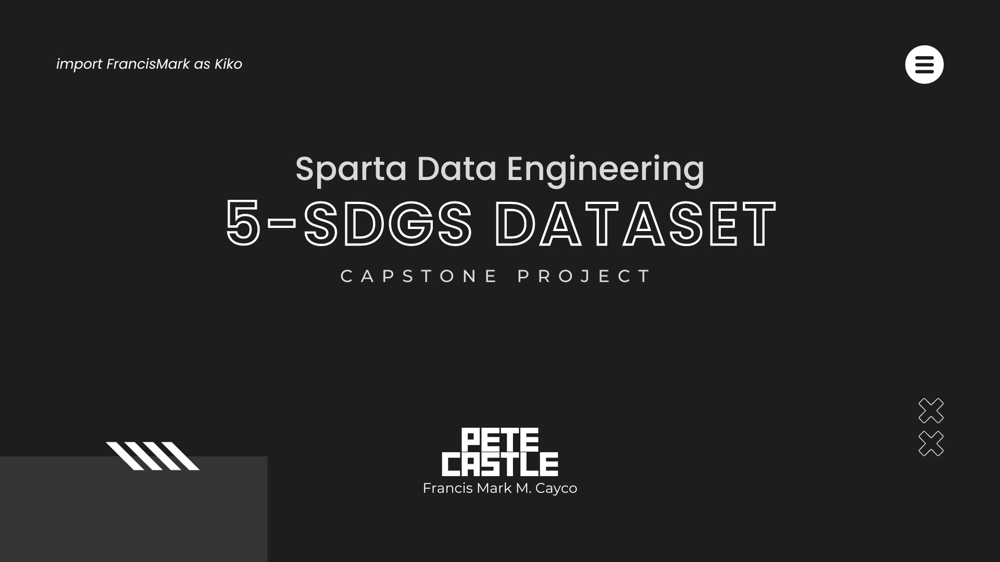
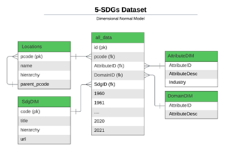
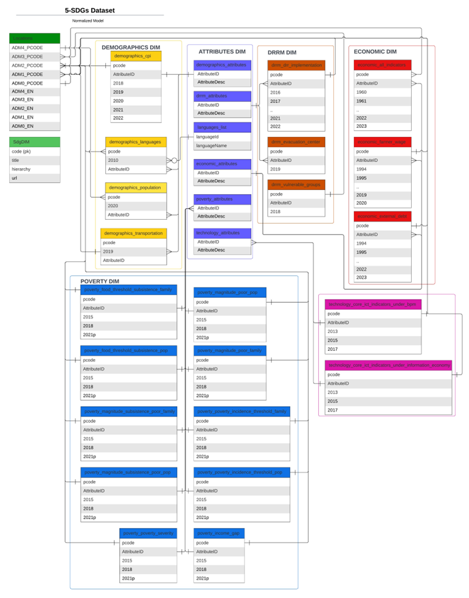

# 5-SDGs Dataset

The **Sustainable Development Goals (SDGs)** established by the United Nations are a plan aimed at promoting peace and prosperity. These 17 interconnected goals were unanimously adopted by all member states in 2015 as part of the 2030 agenda, for development. It is crucial to acknowledge their significance within society. The SDGs provide a framework that transcends borders encouraging collaboration among countries organizations and individuals to address pressing challenges. By prioritizing collaboration, inclusivity, and sustainability the SDGs strive to improve the well-being of both people and the planet while ensuring that no one is left behind.

Objectives:
- Develop a comprehensive '5-SDGs Dataset' by aggregating, transforming, and loading data from multiple sources.
- The dataset should encompass a wide range of socio-economic, disaster resilience, poverty, demographics, and technology-related attributes from various CSV files, such as agricultural wage rates, external debt, disaster risk reduction and management (DRRM) indicators, poverty statistics, demographics (population, language, etc.), and technology adoption statistics.
- Ensure that the dataset contributes to the development of 5 United Nations sustainable development goals – No Poverty, Decent Work and Economic Growth, Sustainable Cities and Communities, Climate Action, and Peace, Justice, and Strong Institutions. 
- The result should be user-friendly and conform to dimensional normal form.

## Data Sources
**OpenSTAT** is a public dataset serviced under the Philippine Statistics authority.  It offers multiple data under different domains including bot not limited to demographics, economics, environment, etc.  Most of raw datasets in this project comes in this website.

Some datasets collected by the **Humanitarian Data Exchange** were used in this project, commonly datasets that are partially cleaned and aggregated from OpenSTAT’s website.

## Extract
All CSV files were downloaded from their respective sources.  For OpenSTAT files, I’ve only selected geographical locations of the lowest degree available to ensure the high granularity of the dataset.  For the complete list of datasets, their attributes and granularity, refer to Table 2: List of Source Datasets and its Attributes

## Transform
**General Transformation Rule**

To maintain a consistent and organized format for data transformation, the following rules were applied to all dimensions using Pandas DataFrame.
- The granularity should be one row per geographical location (could be national, regional, provincial, municipal, or barangay level).
- Each row should correspond to one attribute.  Therefore, one metric per row.
- To facilitate the observation of data changes over time, each column is associated with a specific year. It is important to note that not all columns may contain values; however, a single column should have a value associated with it for each row.
  
**Population Data**

As the dataset is not consistent with the location dataset, I’ve used similarity index to create a mapping between two datasets.  In turn, join performance has decreased significantly.
All of these datasets are placed in the database as a staging table.

**Normalized Model**

In transforming the cleaned and consistent models into a normalized model, all datasets were appended or combined to a single domain table.  In tables where the attribute is not specified, the table name is used as the attribute in the domain table.

Then, all attributes were transferred to another dimension entitled “AttributeDim”.  Attributes within dimensions are now foreign keys in the attribute dimensions. 

The location data has been aggregated where administrative names of multiple levels have been combined into one column to make it compatible with object-relational model.  Like attribute dimensions, all geolocations within dimensions are now foreign keys in the location dimension.

All of these datasets are placed in the database as the dimension table.

See Figure 3: Normalized Model on the next page for the normalized model.

## Load
All staging tables are now loaded in the SQLite database, ready for consumption of the end users.  

**Dimensional Normal Form**

The dimensional normal form of the dataset combines all fact values from dimension tables: demographics, DRRM, economic, poverty, and technology sector into a single huge fact table.

The dimension follows mostly star schema, with all data acting as the fact table and the location, attribute, domain, and SDG tables acting as the dimension tables.

The granularity remains the same.

All individual attribute dimensions have also been combined into one table, with the addition of Industry column that is only used in technology dimension.

## Normalized Model
